# Climate-Change-Analytics

Tracking and analyzing global sea surface temperatures.

Note: SST stands for sea surface temperature (measurements made at a depth of less than 20m).

## Part 1: Data cleaning and EDA
The original dataset, which can be found [here](http://cdiac.ess-dive.lbl.gov/ftp/oceans/GLODAPv2/Data_Products/data_product/), consisted of 100 columns, many of which were highly correlated by definition (e.g. "potential temperature" is a function of temperature and air pressure). Preliminary data cleaning consisted of eliminating these subsidiary columns in order to improve processing speeds when reading the CSV to a pandas DataFrame. Further data cleaning involved trimming the dataset down to only the few columns relevant to the intended hypothesis tests.

A correlation heat map was plotted to visualize correlation between features and to detail their exact coefficients of correlation.

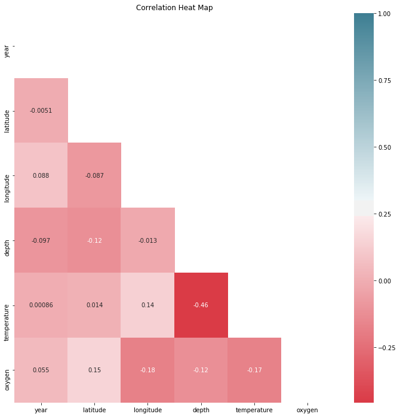

<!-- The two predictive features of interest were (originally) temperature and dissolved oxygen content; each was scatter plotted against time.

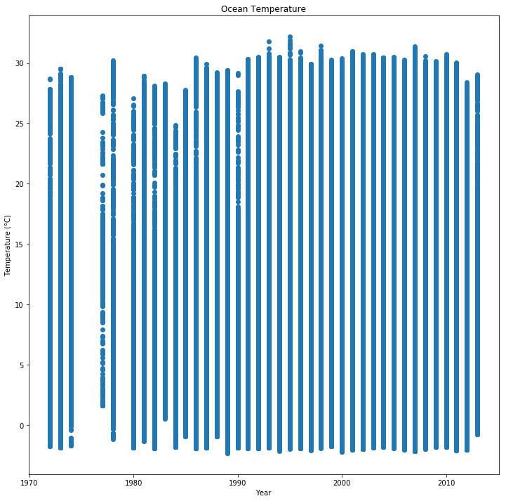
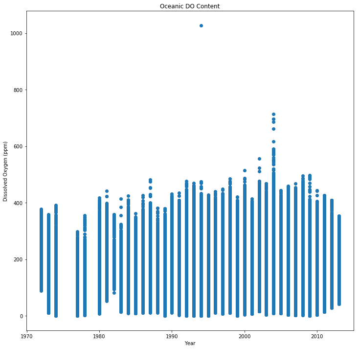 -->

Due to the high correlation between depth and temperature, and because SST is a typical indicator for climate change, the data was further trimmed to include only sea surface measurements.

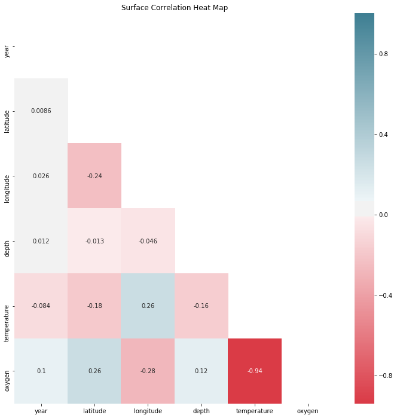

Again, temperature and oxygen were plotted against time. Notice the high variability in temperatures; this will become relevant soon.

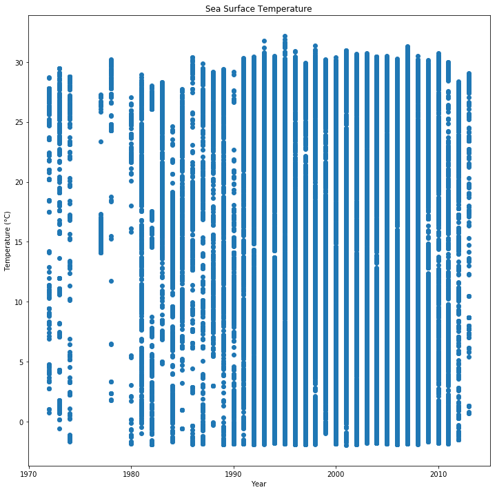
<!-- 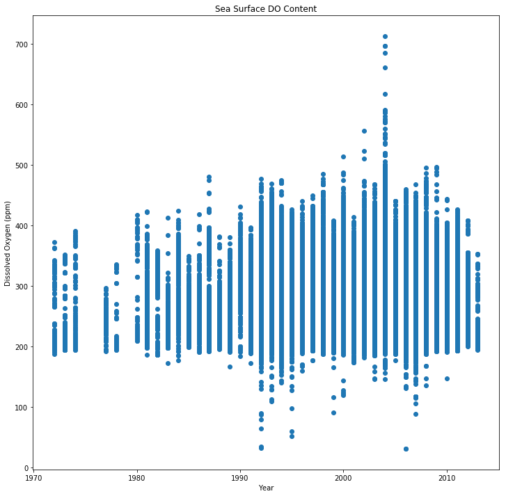 -->

A scatter matrix was plotted between all available features to further visualize the data (and, interestingly, to plot a rough globe when plotting latitude vs longitude).

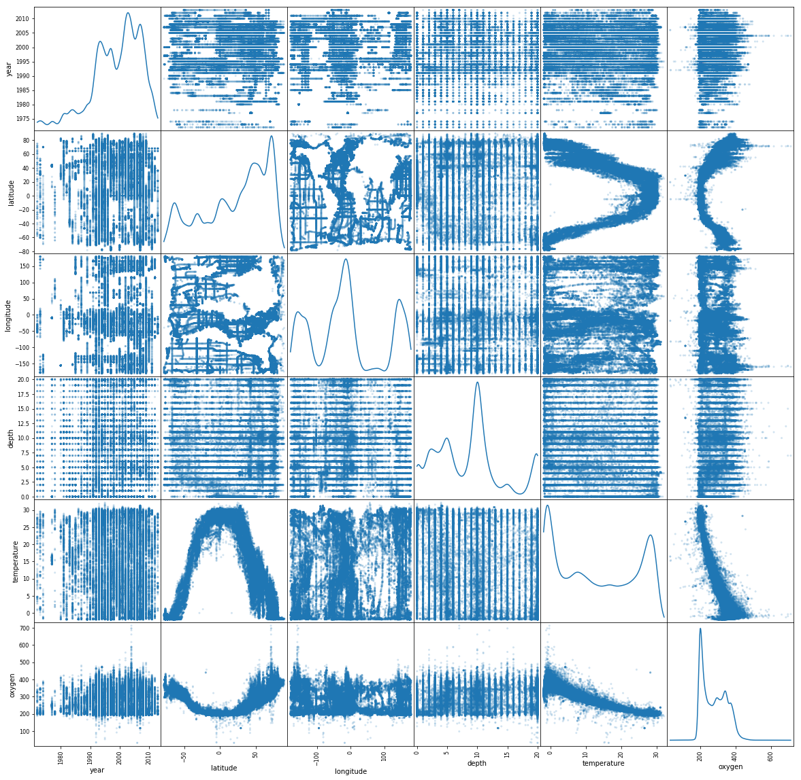

Due to the extremely high correlation between dissolved oxygen content and temperature, focus was directed primarily on SST. The aforementioned variance in annual temperature may correspond to seasonal variance; to this end, data was split into northern and southern hemispheres, excluding the tropics, then rejoined based on the typical summer and winter months in each hemisphere.

Mean seasonal temperatures were then plotted against year.

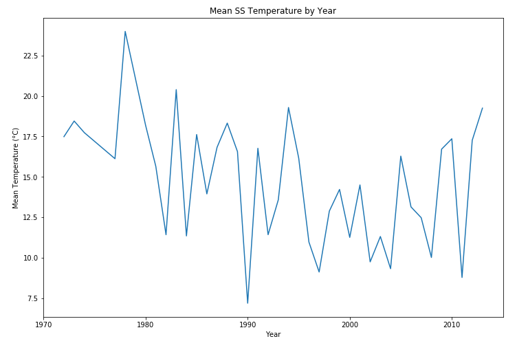
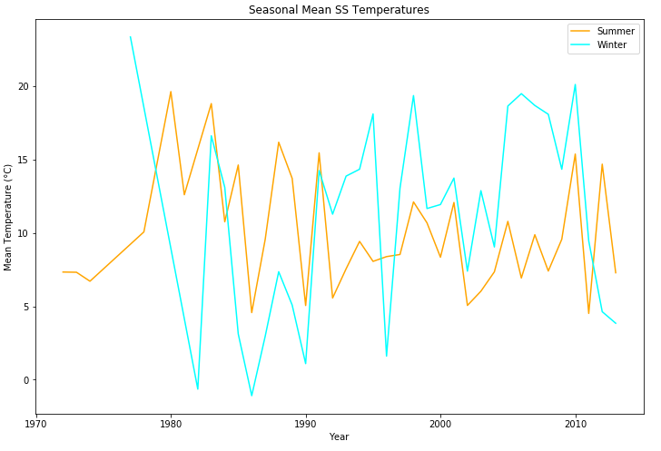

There is still a great deal of variability from year to year, but perhaps a trend can be predicted.

## Part 2: Hypothesis testing

### Question:
Are sea surface temperatures in the early 2000s (2000 to 2009) significantly different from those in the 1990s?

### Welch's t-test comparing winter SST in the 1990s to the 2000s:

Null Hypothesis 1: 1990s winter SST = 2000s winter SST

Alternative Hypothesis 1: 1990s winter SST != 2000s winter SST

Significance level: 0.05 (two-tailed)

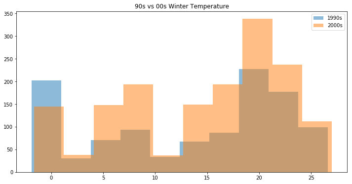
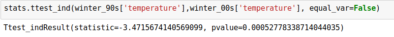

A p-value of ~0.0005 indicates that the null hypothesis should be rejected in favor of the null hypothesis. Winter sea surface temperatures in the early 2000s are significantly different from those in the 1990s.

### Welch's t-test comparing summer SST in the 1990s to the 2000s (2000 to 2009).

Null Hypothesis 2: 1990s summer SST = 2000s summer SST

Alternative Hypothesis 1: 1990s summer SST != 2000s summer SST

Significance level: 0.05 (two-tailed)

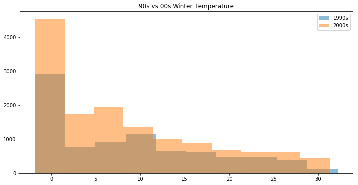
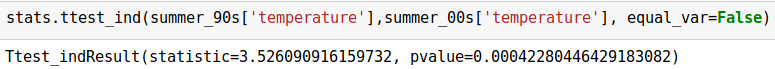

A p-value of ~0.0004 indicates that the null hypothesis should be rejected in favor of the null hypothesis. Summer sea surface temperatures in the early 2000s are significantly different from those in the 1990s.

In fact, mean summer temperatures were ~0.44°C colder in the 2000s, while mean winter temperatures were ~1.19°C warmer.

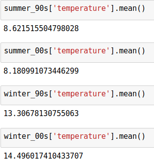

### Temperature by decade is not normally distributed, but the t-test can still provide valid results with such large sample sizes. Below, p-values are calculated with the nonparametric Mann-Whitney U test to confirm the t-test results.

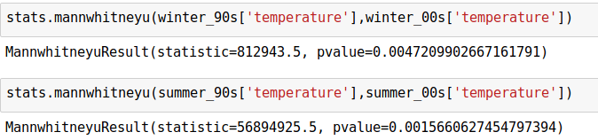

Again, p-values of ~0.005 and ~0.002 indicate, respectively, that summer and winter sea surface temperatures in the early 2000s are significantly different from those in the 1990s.

## Part 3: Predictive Modeling (Future studies)

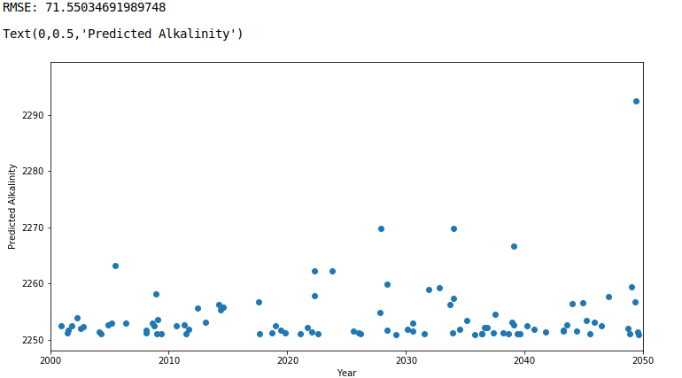

##### Citation:
Olsen, A., R. M. Key, S. van Heuven, S. K. Lauvset, A. Velo, X. Lin, C. Schirnick, A. Kozyr, T. Tanhua, M. Hoppema,
S. Jutterström, R. Steinfeldt, E. Jeansson, M. Ishii, F. F. Pérez and T. Suzuki. The Global Ocean Data Analysis Project
version 2 (GLODAPv2) - an internally consistent data product for the world ocean, Earth System Science Data, 8, 297-323, 2016.
doi: 10.5194/essd-8-297-2016
